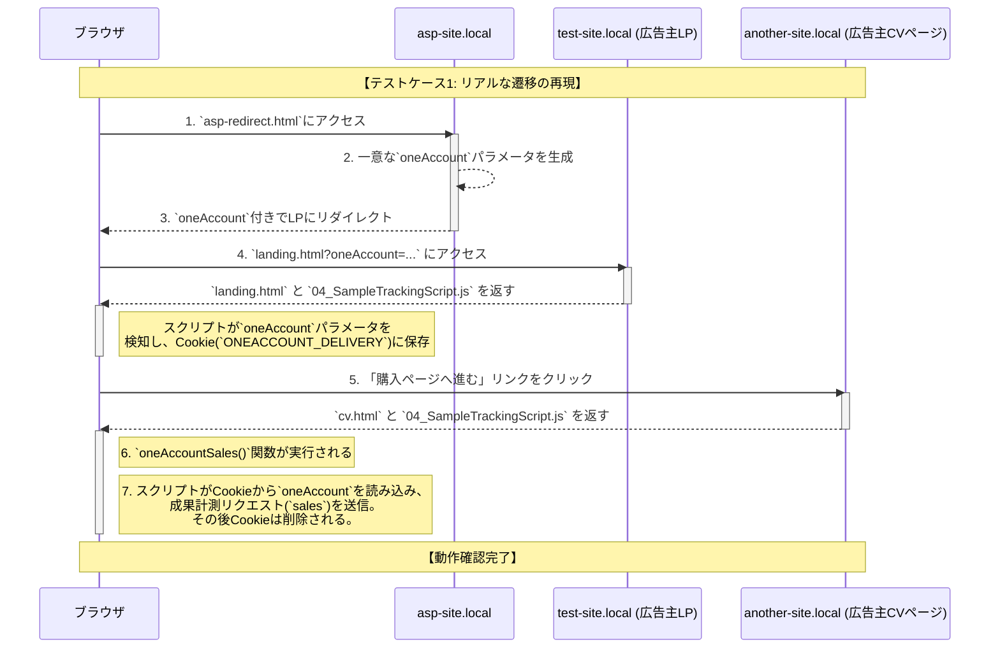

# トラッキングスクリプト動作確認手順

`04_SampleTrackingScript.js`の成果計測およびクロスドメイン機能の動作を、Dockerを使用してローカル環境で確認するための手順書です。

## 概要

ASP（アフィリエイト・サービス・プロバイダ）からのリダイレクトを模倣する環境を構築し、以下の実践的なシナリオを検証します。

1.  **ASPリダイレクト**: ASPサイトから広告主サイトへ、トラッキングパラメータを付与して正しくリダイレクトされるか。
2.  **クロスドメイン機能**: 広告主サイト内でドメインをまたいでも、トラッキング情報が引き継がれるか。
3.  **成果計測機能**: 最終的なCVページで、引き継がれた情報を使って正しく成果が計測されるか。

-----

## 1. 環境構築

### 前提

  * Dockerがインストールされていること。
  * テキストエディタが利用できること。

### 1.1. フォルダ構成

まず、作業フォルダ（例: `tracking-test`）を任意の場所に作成し、その中に以下のファイルとフォルダを配置します。

```
tracking-test/
├── docker-compose.yml
├── README.md               (このファイル)
├── html/
│   ├── 04_SampleTrackingScript.js
│   ├── asp-redirect.html   (ASPリダイレクト模倣ページ)
│   ├── cv.html
│   └── landing.html
└── nginx/
    └── default.conf
```

### 1.2. ファイルの作成

各ファイルに以下の内容をコピー＆ペーストしてください。

<details>
<summary><code>docker-compose.yml</code></summary>

```yaml
services:
  web:
    image: nginx:latest
    ports:
      - "8080:80"
    volumes:
      - ./html:/usr/share/nginx/html
      - ./nginx/default.conf:/etc/nginx/conf.d/default.conf
```

</details>

<details>
<summary><code>nginx/default.conf</code></summary>

```nginx
server {
    listen 80;
    server_name test-site.local;

    location / {
        root /usr/share/nginx/html;
        index index.html;
    }
}

server {
    listen 80;
    server_name another-site.local;

    location / {
        root /usr/share/nginx/html;
        index index.html;
    }
}

server {
    listen 80;
    server_name asp-site.local;

    location / {
        root /usr/share/nginx/html;
        index index.html;
    }
}
```

</details>

<details>
<summary><code>html/asp-redirect.html</code> </summary>

```html
<!DOCTYPE html>
<html lang="ja">
<head>
    <meta charset="UTF-8">
    <title>ASP Redirecting...</title>
</head>
<body>
    <p>ASPサイトから広告主サイトへリダイレクトしています...</p>
    <script>
        // クリックを識別するための一意なパラメータを生成
        const oneAccountValue = 'click-' + Date.now() + '-' + Math.random().toString(36).substring(2);

        // 広告主サイトのLPへ、パラメータを付与してリダイレクト
        const destinationUrl = `http://test-site.local:8080/landing.html?oneAccount=${oneAccountValue}`;
        
        // 画面にリダイレクト先URLを表示
        document.body.innerHTML += `<p><b>リダイレクト先:</b> ${destinationUrl}</p>`;

        // 0.5秒後にリダイレクトを実行
        setTimeout(() => {
            window.location.replace(destinationUrl);
        }, 500);
    </script>
</body>
</html>
```

</details>

<details>
<summary><code>html/landing.html</code></summary>

```html
<!DOCTYPE html>
<html lang="ja">
<head>
    <meta charset="UTF-8">
    <title>Landing Page</title>
    <script src="04_SampleTrackingScript.js"></script>
</head>
<body>
    <h1>Landing Page (test-site.local)</h1>
    <p>下のリンクをクリックして、別ドメインのCVページに移動します。</p>

    <a href="http://another-site.local:8080/cv.html">購入ページへ進む (another-site.local)</a>

</body>
</html>
```

</details>

<details>
<summary><code>html/cv.html</code></summary>

```html
<!DOCTYPE html>
<html lang="ja">
<head>
    <meta charset="UTF-8">
    <title>CV Page</title>
    <script src="04_SampleTrackingScript.js"></script>
</head>
<body>
    <h1>CV Page (購入完了)</h1>
    <p>このページで成果が計測されます。</p>

    <span id="oneAccountSales"></span>

    <script>
        // ページの読み込みが完了したら、oneAccountSales関数を実行
        window.onload = function() {
            oneAccountSales({
                pid: 's00000000000001', // 15文字のプログラムID
                items: [
                    {
                        code: 'item-001',
                        price: 1000,
                        quantity: 2
                    },
                    {
                        code: 'item-002',
                        price: 500,
                        quantity: 1
                    }
                ],
                order_number: 'ORDER-12345',
                total_price: 2500, // 合計金額
                currency: 'JPY'
            });
        };
    </script>
</body>
</html>
```

</details>

### 1.3. hostsファイルの設定

お使いのPCの`hosts`ファイルに、以下の1行を追加して保存します。（管理者権限が必要です）

  * **Mac**: `/private/etc/hosts`
  * **Windows**: `C:\Windows\System32\drivers\etc\hosts`

<!-- end list -->

```
127.0.0.1  test-site.local another-site.local asp-site.local
```

### 1.4. Dockerの起動

ターミナルを開き、`tracking-test` フォルダに移動して、以下のコマンドを実行します。

```bash
# 初回起動
docker-compose up -d

# 設定変更を反映させる場合はこちら
docker-compose restart
```

-----

## 2. 動作確認手順

ブラウザの**デベロッパーツール**（`F12`キーや `Cmd+Opt+I`）を開きながらテストを進めます。

### テストケース1: リアルな遷移の再現（推奨）



メディアサイト → ASP → 広告主LP → 広告主CV という実践的なフローをテストします。

1.  テストの開始点として、ASPのリダイレクトページにアクセスします。
    ```
    http://asp-site.local:8080/asp-redirect.html
    ```
2.  ページが一瞬表示された後、自動的に `http://test-site.local:8080/landing.html` にリダイレクトされます。このとき、URLの末尾に `?oneAccount=...` というパラメータが付与されていることを確認します。
3.  `landing.html` が表示されたら、ページ内の「購入ページへ進む」リンクをクリックします。
4.  `cv.html` に遷移したら、エラーが表示されず、成果計測が正しく実行されることを確認します。

#### 確認するポイント

  * **Consoleタブ**: 「成果通知を送信しました」というログが表示され、エラーがないこと。
  * **Networkタブ**: `sales` というファイルへのリクエストが送信されていること。
  * **Application > Cookies**: `landing.html`で`ONEACCOUNT_DELIVERY`が生成され、`cv.html`遷移後に`_oneAccount_...`のCookieが（リピートでなければ）削除されること。

### テストケース2: 個別機能の基本的な確認

各ページを直接開いて、個別の機能を確認したい場合のテストです。

  * **クロスドメイン機能の直接テスト**:
    `http://test-site.local:8080/landing.html?oneAccount=test_value` にアクセスし、リンクのURLが書き換わるかを確認します。
  * **成果計測の直接テスト**:
    `http://another-site.local:8080/cv.html?oneAccount=test_value` にアクセスし、成果計測が実行されるかを確認します。

-----

## 3. トラブルシューティング

### "port is already allocated" エラー

  * **原因**: 他のプログラムがポート`80`を使用しています。
  * **対策**: `docker-compose.yml` の `ports`設定を `"80:80"` から `"8080:80"` など、空いているポートに変更します。その場合、テストURLも `http://...:8080/...` のように変更する必要があります。

### "503 Service Temporarily Unavailable" エラー

  * **原因**: Nginxコンテナがファイルにアクセスできず、正常に応答できていません。主にファイルの権限問題です。
  * **対策**: ターミナルで以下のコマンドを実行し、ファイルに読み取り権限を与えてからコンテナを再起動してください。
    ```bash
    # ファイルとフォルダに権限を付与
    chmod +r html/*
    chmod +rx html

    # コンテナを再起動
    docker-compose restart
    ```

### "クリック識別子が取得できませんでした" エラー

  * **原因**: `cv.html` に `oneAccount` パラメータが引き継がれていません。テスト手順が誤っている可能性があります。
  * **対策**: **テストケース1の手順**に従い、ASPのリダイレクトページからテストを開始してください。

-----

## 4. 環境の停止

テストが終了したら、以下のコマンドでコンテナを停止・削除できます。

```bash
docker-compose down
```